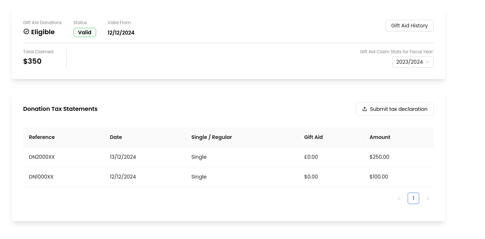

# Bitcoin2024 Hackathon project

We created a NFC-ready Point of Sale system that is applying for the bounties by:
- RootStock
- BOB SDK
- Citrea
- Rooch
- GOAT

The general idea behind it is to have two phones exchanging the information needed to perform a transaction using the NFC contactless technology. In this way we were able to create a fully decentralized peer-to-peer system to make transaction between nearby devices.
The transactions are authored by smart contracts that we deployed both on the RootStock and BOB networks.
We also used Zero-knowledge proofs and semi-homomorphic encryption to generate trustable tax statements that could be sent to government agencies.

# Rootstock

The contract is available in [this folder](https://github.com/albertoZurini/Bitcoin2024/tree/main/contracts/rootstock), to interact with it a [web app](https://github.com/albertoZurini/Bitcoin2024/tree/main/frontend) has been developed. This app is communicating via deep-links to our [android app](https://github.com/albertoZurini/Bitcoin2024/tree/main/android-app) that will take care of exchanging NFC messages.

# Citrea

We created a webapp, that will trigger [a script responsible for generating the tax statement](https://github.com/albertoZurini/Bitcoin2024/blob/main/ZKP/generator/main.py). The data generated by this script, is then [processed in a pipeline](https://github.com/albertoZurini/Bitcoin2024/blob/main/ZKP/pipeline.py) to generate the ZKP and the contract that can be deployed on the Citrea Network to assess on-chain ZK verifications.

# BOB

[Have a look here](https://github.com/albertoZurini/Bitcoin2024/tree/main/contracts/bob-contracts).

# GOAT

[Have a look here](https://github.com/albertoZurini/Bitcoin2024/tree/main/GOAT).